<!-- Custom SVG Banner -->

  

<!-- Profile Views Counter & Badges -->

  
  
  

---

## 🚀 About Me

I am a **Neuromorphic & Memristive Systems Researcher** working at the intersection of analog-digital neuromorphic hardware, memristive in-memory computing, and computational modeling. My current focus is bridging structural plasticity and stable memory retention to build energy-efficient, brain-inspired computing paradigms.

- 🎓 **B.Tech in Computer Science & Engineering** — VIT Chennai (CGPA 9.01/10)
- 🏆 **APJ Abdul Kalam Award** & **IEEE YESIST12'24 Finalist**
- 🤝 **Open to collaboration** on neuromorphic hardware, memristive systems, and spiking neural networks.

---

## 📄 Peer-Reviewed Publications

  <!-- Paper 1 -->
  <table style="border: 1px solid #30363d; border-collapse: collapse; border-radius: 8px; width: 100%; margin-bottom: 12px; background-color: #0d1117;">
    <tr style="background-color: #161b22;">
      <th align="left" style="padding: 10px; color: #a855f7;">🧠 NEUROMORPHIC COMPUTING</th>
      <th align="right" style="padding: 10px;">IEEE ACCESS (2025)</th>
    </tr>
    <tr>
      <td colspan="2" style="padding: 15px;">
        <strong>A Hybrid Neuromorphic Framework With Dual-Mode Memory and Adaptive Synaptic Plasticity</strong>
        

          Proposes an integrated analog-digital neuromorphic framework featuring dual-mode memory. Solves the speed vs. precision trade-off by combining short-term plasticity and long-term potentiation.
        

        
      </td>
    </tr>
  </table>

  <!-- Paper 2 -->
  <table style="border: 1px solid #30363d; border-collapse: collapse; border-radius: 8px; width: 100%; margin-bottom: 12px; background-color: #0d1117;">
    <tr style="background-color: #161b22;">
      <th align="left" style="padding: 10px; color: #a855f7;">⚡ EDGE INFRASTRUCTURE</th>
      <th align="right" style="padding: 10px;">IEEE ACCESS (2026)</th>
    </tr>
    <tr>
      <td colspan="2" style="padding: 15px;">
        <strong>S-Edge: A Multi-Region Edge Computing Framework With Adaptive Data Compression and Dynamic Load Balancing</strong>
        

          Introduces a load balancing framework for edge computing nodes using a hysteresis-based decision loop and on-the-fly packet compression to maximize network throughput and minimize latency.
        

        
      </td>
    </tr>
  </table>

  <!-- Paper 3 -->
  <table style="border: 1px solid #30363d; border-collapse: collapse; border-radius: 8px; width: 100%; margin-bottom: 12px; background-color: #0d1117;">
    <tr style="background-color: #161b22;">
      <th align="left" style="padding: 10px; color: #a855f7;">💾 DATA MODELING / EMBEDDED SYSTEMS</th>
      <th align="right" style="padding: 10px;">SCIENTIFIC REPORTS (NATURE)</th>
    </tr>
    <tr>
      <td colspan="2" style="padding: 15px;">
        <strong>Circular Loop Data Model (CLDM): A Novel Approach To Simplifying Data Management for Rapid Prototyping</strong>
        

          Introduces a lightweight data model and domain-specific language (DSL) structuring application state as named parallel string loops in a single BSON file. Provides schema-free concurrency and fast reads for local embedded/prototyping workloads.
        

        
        
      </td>
    </tr>
  </table>

---

## 💻 Technical Architecture & Stack

| Domain | Technologies |
| :--- | :--- |
| **🧠 Research & Sim** |     |
| **💻 Languages** |        |
| **⚙️ Engines & Tools** |    |
| **☁️ DevOps & Cloud** |     |
| **🗄️ Databases** |   |

---

## 🎯 Featured Projects

  <!-- Axiom Zero -->
  <table style="border: 1px solid #30363d; border-collapse: collapse; border-radius: 8px; width: 100%; margin-bottom: 12px; background-color: #0d1117;">
    <tr style="background-color: #161b22;">
      <th align="left" style="padding: 10px; color: #a855f7;">🎮 Axiom Zero (In Development)</th>
      <th align="right" style="padding: 10px;">Unreal Engine 5.6</th>
    </tr>
    <tr>
      <td colspan="2" style="padding: 15px;">
        A sci-fi cyberpunk third-person shooter featuring an 18-mission narrative across 5 city zones, built with a custom neural-ability upgrade tree and event-driven AI systems.
      </td>
    </tr>
  </table>

  <!-- NeuroSpark OS -->
  <table style="border: 1px solid #30363d; border-collapse: collapse; border-radius: 8px; width: 100%; margin-bottom: 12px; background-color: #0d1117;">
    <tr style="background-color: #161b22;">
      <th align="left" style="padding: 10px; color: #a855f7;">🖥️ NeuroSpark OS</th>
      <th align="right" style="padding: 10px;">Systems (C / Assembly)</th>
    </tr>
    <tr>
      <td colspan="2" style="padding: 15px;">
        A bare-metal x86 operating system featuring kernel-space Spiking Neural Network (SNN) simulation and custom neuromorphic hardware context switching.
      </td>
    </tr>
  </table>

  
  

---

## 📊 Live Insights & Activity

<table width="100%">
  <tr>
    <td width="50%" valign="top">
      <h3>🕒 Recent Activity</h3>
<!--RECENT_ACTIVITY:START-->
<table width="100%" style="border: 1px solid #30363d; border-collapse: collapse; border-radius: 6px;">
  <thead>
    <tr style="background-color: #161b22;">
      <th align="left" style="padding: 8px; font-size: 13px;">Action Log</th>
      <th align="left" style="padding: 8px; font-size: 13px;">Timestamp</th>
    </tr>
  </thead>
  <tbody>
  <tr>
    <td style="padding: 8px; border-top: 1px solid #30363d; font-size: 13px;"> Made <code>Emir2099/github_insights</code> public</td>
    <td style="padding: 8px; border-top: 1px solid #30363d; font-size: 13px;"><i>344d ago</i></td>
  </tr>
  <tr>
    <td style="padding: 8px; border-top: 1px solid #30363d; font-size: 13px;"> Pushed <b>2 commit(s)</b> to <code>Emir2099/Emir2099</code></td>
    <td style="padding: 8px; border-top: 1px solid #30363d; font-size: 13px;"><i>8d ago</i></td>
  </tr>
  <tr>
    <td style="padding: 8px; border-top: 1px solid #30363d; font-size: 13px;"> Pushed <b>1 commit(s)</b> to <code>Emir2099/QAT-Superposition</code></td>
    <td style="padding: 8px; border-top: 1px solid #30363d; font-size: 13px;"><i>8d ago</i></td>
  </tr>
  <tr>
    <td style="padding: 8px; border-top: 1px solid #30363d; font-size: 13px;"> Created <b>branch</b> <code>main</code> in <code>Emir2099/QAT-Superposition</code></td>
    <td style="padding: 8px; border-top: 1px solid #30363d; font-size: 13px;"><i>8d ago</i></td>
  </tr>
  <tr>
    <td style="padding: 8px; border-top: 1px solid #30363d; font-size: 13px;"> Pushed <b>2 commit(s)</b> to <code>Emir2099/Emir2099</code></td>
    <td style="padding: 8px; border-top: 1px solid #30363d; font-size: 13px;"><i>9d ago</i></td>
  </tr>
  </tbody>
</table>
<!--RECENT_ACTIVITY:END-->
    </td>
    <td width="50%" valign="top">
      <h3>💻 Language Footprint</h3>
<!--LANGUAGES:START-->
<table width="100%" style="border: 1px solid #30363d; border-collapse: collapse; border-radius: 6px;">
  <thead>
    <tr style="background-color: #161b22;">
      <th align="left" style="padding: 8px; font-size: 13px;">Language</th>
      <th align="left" style="padding: 8px; font-size: 13px;">Distribution</th>
      <th align="left" style="padding: 8px; font-size: 13px;">Weight</th>
    </tr>
  </thead>
  <tbody>
  <tr>
    <td style="padding: 8px; border-top: 1px solid #30363d; font-size: 13px;"></td>
    <td style="padding: 8px; border-top: 1px solid #30363d; font-size: 13px;"><code>██░░░░░░░░░░</code></td>
    <td style="padding: 8px; border-top: 1px solid #30363d; font-size: 13px;"><b>16.7%</b></td>
  </tr>
  <tr>
    <td style="padding: 8px; border-top: 1px solid #30363d; font-size: 13px;"></td>
    <td style="padding: 8px; border-top: 1px solid #30363d; font-size: 13px;"><code>██░░░░░░░░░░</code></td>
    <td style="padding: 8px; border-top: 1px solid #30363d; font-size: 13px;"><b>14.1%</b></td>
  </tr>
  <tr>
    <td style="padding: 8px; border-top: 1px solid #30363d; font-size: 13px;"></td>
    <td style="padding: 8px; border-top: 1px solid #30363d; font-size: 13px;"><code>█░░░░░░░░░░░</code></td>
    <td style="padding: 8px; border-top: 1px solid #30363d; font-size: 13px;"><b>11.9%</b></td>
  </tr>
  <tr>
    <td style="padding: 8px; border-top: 1px solid #30363d; font-size: 13px;"></td>
    <td style="padding: 8px; border-top: 1px solid #30363d; font-size: 13px;"><code>█░░░░░░░░░░░</code></td>
    <td style="padding: 8px; border-top: 1px solid #30363d; font-size: 13px;"><b>11.7%</b></td>
  </tr>
  <tr>
    <td style="padding: 8px; border-top: 1px solid #30363d; font-size: 13px;"></td>
    <td style="padding: 8px; border-top: 1px solid #30363d; font-size: 13px;"><code>█░░░░░░░░░░░</code></td>
    <td style="padding: 8px; border-top: 1px solid #30363d; font-size: 13px;"><b>10.4%</b></td>
  </tr>
  <tr>
    <td style="padding: 8px; border-top: 1px solid #30363d; font-size: 13px;"></td>
    <td style="padding: 8px; border-top: 1px solid #30363d; font-size: 13px;"><code>█░░░░░░░░░░░</code></td>
    <td style="padding: 8px; border-top: 1px solid #30363d; font-size: 13px;"><b>8.8%</b></td>
  </tr>
  </tbody>
</table>
<!--LANGUAGES:END-->
    </td>
  </tr>
</table>

Refreshed automatically every 6 hours by `update-readme.yml` via GitHub Actions.

---

## 📊 GitHub Statistics

  
  

  

  <picture>
    <source media="(prefers-color-scheme: dark)" srcset="https://raw.githubusercontent.com/platane/snk/output/github-contribution-grid-snake-dark.svg">
    <source media="(prefers-color-scheme: light)" srcset="https://raw.githubusercontent.com/platane/snk/output/github-contribution-grid-snake.svg">
    
  </picture>

---

## 🤝 Let's Connect

  
  

  

🎮 Click here for a surprise!

 

  
  <h3>Thanks for finding the easter egg! 🎉</h3>

